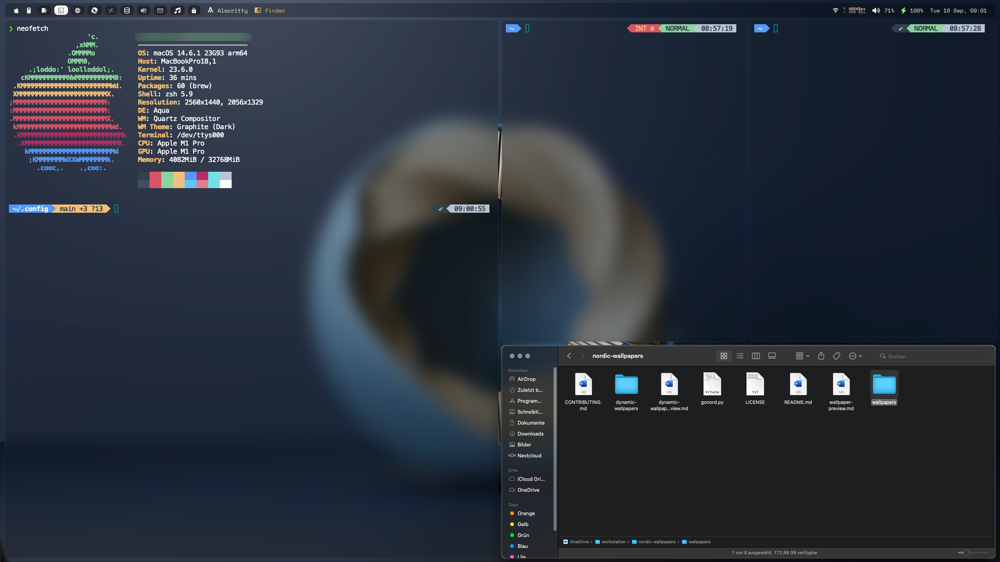

# my macOS dotfiles

## Screenshot

  

## really great applications that I use

- Aerospace  
The best tiling window manager for MacOS
https://github.com/nikitabobko/AeroSpace

- Sketchybar  
The highly configurable top bar
https://github.com/FelixKratz/SketchyBar

- Sketchybar configuration  
https://github.com/bfpimentel/nixos.git  
a really good lua scripted Sketchybar configuration  

(make sure to install lua: `brew install lua`)   
Modify `.config/sketchybar/items/spaces.lua` according to what spaces you have configured in aerospace.toml. I added further hints in the spaces.lua file.  

- brew  
A Package manager for MacOS that is needed/can be used to install great open source software like Aerospace.   
https://brew.sh/

- Required Font for Sketchybar  
`font-space-mono-nerd-font`

- alacritty   
A fast terminal that lets you disable decorations and activate blur/transparency
https://github.com/alacritty/alacritty

- marta  
Great alternative to Finder which allows vim-style bindings. I "disable" the second pane for now by moving the separator 100% to the right. Does not search for configuration in `.config`, so I symlinked it like this:

`ln -s ~/.config/marta/conf.marco "~/Library/Application Support/org.yanex.marta/conf.marco"`

- borders  
see what window is in focus at the moment - it makes a colored border appear
https://github.com/FelixKratz/JankyBorders

- brew packages  
see `brew.txt`

- Wallpaper  
https://www.reddit.com/r/wallpapers/  
https://www.reddit.com/r/wallpapers/comments/1eibln5/abstract_circle_3840x2160/

## Other information

- Shell  
zsh  
oh-my-zsh  

- Browser  
qutebrowser - A great browser that lets you browse the internet via keyboard/vim controls
https://qutebrowser.com/  
qutebrowser theme  
https://github.com/gicrisf/qute-city-lights  

## MacOS settings

I also changed a few settings in MacOS because the defaults interfere with this config

### make Dock and the native MacOS bar auto-hide  
Desktop & Dock - Autohide Dock can be here somewhere  
Control Center - Enable menu bar autohide here  

### disable desktop icons
having desktop icons is not very user-friendly together with tiling window managers and, be honest, it is cluttered most of the time anyways so it is recommended to disable them in "Desktop & Dock"  

### disable window animations
Run in terminal:  
`defaults write -g NSAutomaticWindowAnimationsEnabled -bool false`

### reduce motion (for native fullscreen functionality and maybe some more unnecessary animations)
- System Preferences > Accessibility > Display > Reduce motion

### disable lots of MacOS keyboard shortcuts in the MacOS settings
- disable command+Q in MacOS system settings
- be ready to disable a few more, as I am unsure about what other shortcuts might collide

### Move windows by dragging any part of the window (by holding ctrl+cmd)
Run in terminal:  
`defaults write -g NSWindowShouldDragOnGesture -bool true`

### Displays have separate Spaces
Enable this in MacOS settings "Desktop & dock" or else Sketchybar will not start. In general Aerospace recommends disabling this though.  
Read about it here: https://nikitabobko.github.io/AeroSpace/guide#a-note-on-displays-have-separate-spaces  

Sketchybar might work with the option being disabled in the future.  
https://github.com/FelixKratz/SketchyBar/issues/495  
